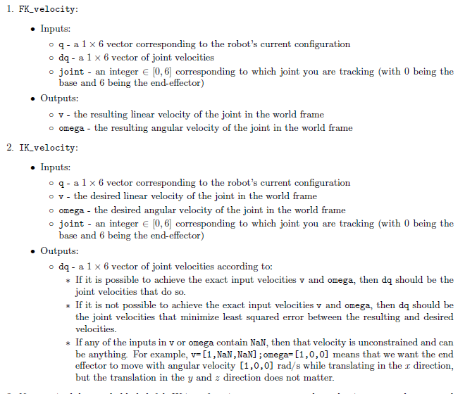

# Robotics

Topics of these labs include: homogeneous transformations, manipulator forward kinematics, manipulator inverse kinematics, Jacobians, and trajectory planning. 

## [Lab 0: Run and Characterize the Lynx in Gazebo](Lab0/)

The purpose of this mini-lab is to become familiar with the Lynxmotion robot manipulator (`Lynx') in
ROS+Gazebo simulation environment. The Lynx is a small robot arm with a parallel-jaw gripper. Specifically, 
we are modelling a Lynxmotion AL5D with the heavy-duty wrist rotate upgrade and SSC-32U Servo
Controller.

The Lynx is a 6-DOF robot. It has 3 degrees of
freedom in the arm, 2 degrees of freedom in the wrist, and 1 degree of freedom
in the gripper. The state of the gripper does not affect the location of our
end effector frame.

## [Lab 1: Kinematic Characterization of the Lynx](Lab1/)

Transform a vector of 6 inputs (the five joint angles and the grip distance) into 
the locations of all the joints and the gripper in 3D space.

## [Lab 2: Inverse Kinematics for the Lynx](Lab2/)

Inputs: a homogeneous transformation matrix `T0e`, representing the end-effector frame expressed in the base frame.

Outputs: 
1. an `n x 5` matrix `q`, where each row is a set of 5 joint variable values that bring the gripper to this pose, and 
1. a flag `isPos` to indicate if a solution is possible. Add a joint limit check to narrow down your possible solutions. Do not need to consider self-collision.

## [Lab 3: Trajectory Planning for the Lynx](Lab3/)

This lab is about planning collision-free trajectories through a cluttered environment using the Lynx
robot. Consider the Lynx robot trying to move from an initial configuration qstart to another configuration
qend. The environment has rectangular block obstacles in it, which can be described by their extreme
coordinates `[xmin; ymin; zmin; xmax; ymax; zmax]`. The goal is for the robot to move from the start point to
the end point without colliding with any of the obstacles. We implemented an `RRT*` planner and then examined its effectiveness compared to `A*`.

## [Lab 4: Jacobians and Velocity Kinematics](Lab4/)

## [Lab 5: Potential Field Planning](Lab5/)

Use a potential field to make the Lynx robot move from a starting configuration to an ending configuration
without colliding with the environment.

## [Final Project](https://github.com/sheilsarda/MEAM520_Final_Project)

Teams will use the concepts learned during the semester to control their simulated Lynx robot in a
head-to-head competition with their opponents’ robot. The robots will manipulate objects in the simulated
environment to score points, culminating in a class-wide tournament.

## Research Paper Readings 

- Funda, J. and Paul, R.P. "A comparison of transforms and quaternions in robotics." Proceedings of the IEEE Conference on Robotics and Automation (ICRA). 1998. pp 886-891. doi: 10.1109/ROBOT.1988.12172
- Hsiao, K. and Kaelbling, L. "Grasping POMDPs." Proceedings of the IEEE International Conference on Robotics and Automation. 2007.
- Salehian, S. and Figueroa, N. "Coordinated multi-arm motion planning: Reaching for moving objects in the face of uncertainty."
